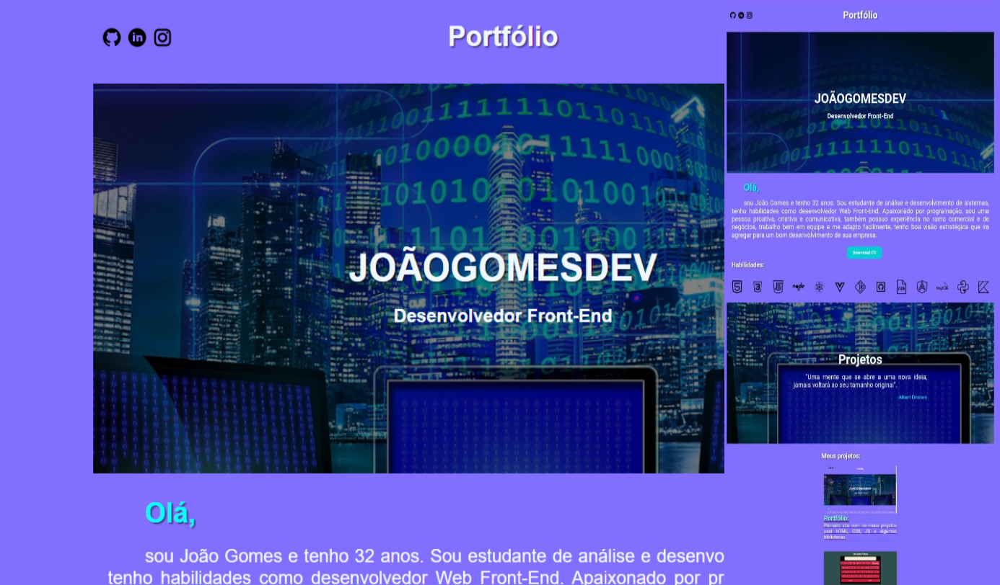

# Portfólio

## **💻 Sobre**

Meu portfólio pessoal, onde exibo informações sobre mim e todos os meus projetos desenvolvidos.

Alguns features existentes são:

- Efeito Parallax;
- Animação e interatividade dos botões;
- Responsividade para dispositivos;

Você pode acessá-lo com este [link.](https://joaogomesdev.netlify.app/)

---

## **🚀 Tecnologias**

Esse projeto foi desenvolvido com as seguintes ferramentas:

- HTML5
- CSS
- JavaScript

---

## **📝 Licença**

Esse projeto está sob a licença MIT. Veja o arquivo [LICENSE](https://github.com/birobirobiro/nlw-heat-origin-v2/blob/main/.github/LICENSE.md) para mais detalhes.

---

Desenvolvido  por João Gomes 👁️‍🗨️
